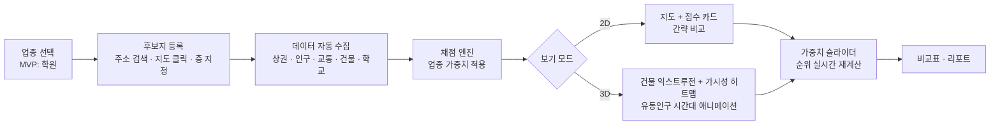
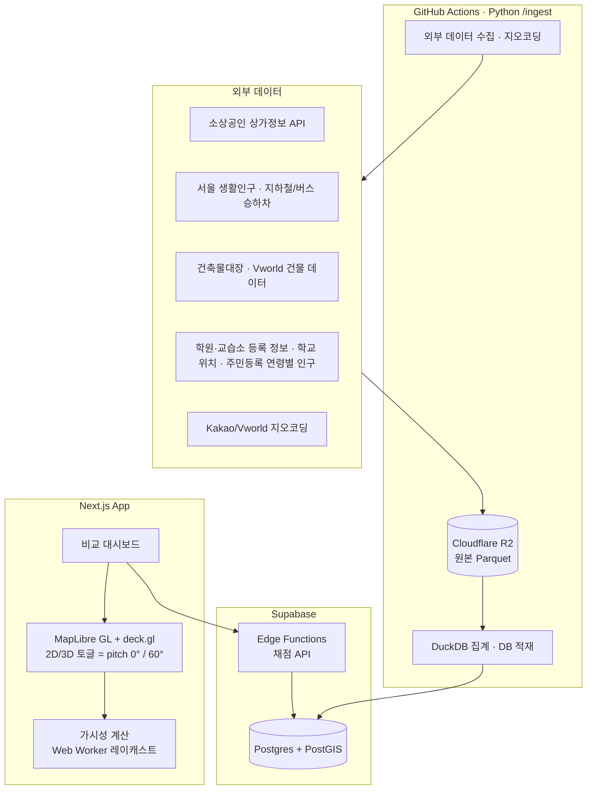

# 길목(GILMOK) 기획서 — 입지 시뮬레이터

> 작성일: 2026-09-16
> 상태: **S1 데이터 기반 완료** (PR 1~7, GitHub #6~#10 머지; PR 8 갱신 운영 경로·마감 문서 구현, 2026-09-22). 실제 데이터 6조합 성능 기준은 PR 7 v1.2로 통과했다. 원격 Supabase 전환·웹훅 활성화는 별도 운영 작업이며 아직 실행하지 않았다.
> Concept: 서비스업 창업자가 후보 점포 여러 곳을 3D 지도 위에서 데이터 기반 점수와 함께 나란히 비교하고, 조건을 바꿔가며 "목"을 시뮬레이션하는 웹 서비스. 첫 업종은 학원.

---

## Phase 1: 이해도 체크 결과 (최종)

| 차원       | 적용 도구          | 확정된 내용                                                                                                                                    | 이해도 |
| ---------- | ------------------ | ---------------------------------------------------------------------------------------------------------------------------------------------- | ------ |
| Focus      | MoSCoW             | Must: 후보지 다중 비교 + 종합점수·항목별 근거 + 2D/3D 토글 + 3D 가시성 분석. Should: 가중치 조정(what-if). Could: 업종 프리셋 확장, 리포트 PDF | 88%    |
| Why        | JTBD               | 창업자가 중개사 말·감 대신 데이터로 입지를 검증하고, 여러 후보를 같은 기준으로 저울질하는 일                                                   | 85%    |
| Definition | Scope In/Out       | In: 서울, 학원업 채점 로직, 후보지 최대 5곳, 임대료 상권 밴드·사용자 입력. Out: 매출 예측, 점포 단위 임대료 데이터(상권 밴드·사용자 입력은 In), 서울 외, 학원 외 업종(구조만 열어둠) | 85% |
| Dividing   | User Story Mapping | 후보지 등록 → 데이터 수집 → 채점 → 2D/3D 비교 → 가중치 조정 → 리포트                                                                           | 88%    |

**전체 이해도: 86%** ✅ 통과

### 사용자 결정 사항

- 1차 사용자: 서비스업 창업자 전반. 첫 업종은 학원, 제품명·구조는 전 업종을 담을 수 있게.
- 3D: 시각화("우와 포인트")와 분석(가시성) 둘 다. 단, 2D 토글로 간략 보기 제공. 2D만으로도 핵심 정보는 완결돼야 함.
- 결과물: 후보지 나란히 비교 + 종합점수/항목별 근거 + 조건 변경 가능.
- S1 적재 범위: 인구·생활인구·교통·상가·학원·학교는 서울 전체, 건축물·실거래·임대동향은 강남구 한정. 서울 전체 건축물 적재는 S2 초반 별도 태스크로 진행한다.
- 생활인구는 고정 연령 컬럼으로 저장하고 학원 채점 입력에 15~19세를 그대로 사용한다. 0~9세에서 0~4·5~9세를 추정 분할하지 않는다. 연령대 평균은 각 컬럼의 유효 날짜만 사용하며 sample_days는 total 기준이다. 세부 결측·편향 정책은 data-sources.md를 따른다.
- S1은 원시 수치 7개 묶음을 반환한다. 채점 축과 가중치, 과목 기준, 학원 등록 가능성 판정은 S2의 `scoring-spec.md`에서 확정한다. 공동주택 세대수는 v2다.
- PR 3 교통은 생활인구와 같은 최근 완료 3개월(2026-06~08)을 사용한다. 6월에서 단위·중복을 검증한 뒤 같은 규칙으로 7·8월을 처리하며, 실측 월 합계의 합÷92일로 일평균을 만든다. 신분당선 대체 추정은 제외한다. 조인율은 실측·미매칭 목록을 보고하고 승하차량 기준 90% 미만이면 먼저 알린다. PR 3은 교통 적재·조회 검증까지이며 전체 RPC는 후속 통합 태스크다.

---

## Phase 2: 기획 아웃풋

### 5. Drawing

#### User Flow



#### 시스템 구조도



외부 API 호출은 `/ingest` 배치에서만 수행한다. 프론트·Edge Function은 Supabase만 조회하며, 지오코딩 결과도 DB 캐시로 제공한다. 주소·건물 캐시 미스의 사용자 흐름은 S3 화면 정의에서 정하고, S1은 배치·캐시 구축까지 진행한다.

### 6. Concept

**엘리베이터 피치**
"서비스업 창업자가 점포 계약 전에 후보지 여러 곳을 3D 지도에서 같은 기준으로 비교하고, 조건을 바꿔가며 어느 자리가 더 좋은 목인지 검증하는 입지 시뮬레이터."

**Value Proposition (보조)**
| 창업자의 Pain | 우리가 해결하는 방식 |
|---|---|
| 중개사 말과 감으로 결정 | 공공데이터 기반 항목별 점수 |
| 후보지끼리 비교 기준이 제각각 | 같은 채점표로 나란히 비교 |
| "2층인데 간판이 보일까?"를 알 수 없음 | 3D 건물 높이 기반 보행자 시선 가시성 계산 |
| 우리 업종에 맞는 분석이 없음 | 업종별 가중치 프리셋(학원부터) |

### 7. Action Plan

#### 기술 스택

- **프론트**: Next.js(App Router), TypeScript, MapLibre GL JS(2D/3D 통합, 오픈소스, 토글은 카메라 pitch만 바꾸면 됨), deck.gl(히트맵·이동 애니메이션 레이어), Zustand(가중치 상태), Web Worker(가시성 계산)
- **백엔드**: Supabase Postgres + PostGIS(반경 조회·집계), Edge Functions(채점 API, S2), Supabase Auth
- **배치·저장**: Python 3.12 + PublicDataReader + DuckDB + psycopg, GitHub Actions 스케줄. 원본은 R2의 `raw/{source}/{YYYY-MM}.parquet`, Supabase에는 조회용 집계와 공간 조회에 필요한 최소 개체 정보를 둔다. 집계 스크립트는 `/ingest`에 둔다.
- **용량·요금 정책**: 로컬 DB에는 500MB 제한을 적용하지 않는다. 원격 Supabase는 S1까지 무료 플랜을 유지하고, S2 서울 전체 건물 적재 시점에 Pro 전환을 검토한다. 이후 PR은 용량 때문에 데이터 구조·필드·해상도·적재 범위를 바꾸지 않고 DB·테이블·인덱스·원본·임시 공간의 실측을 기록한다. 원격 플랜 한도 접근 시 보고하며 자동 축소·유료 전환은 하지 않는다.
- **건물 footprint 갱신 계획**: GIS건물통합정보 SHP는 **수동 다운로드 후 R2 raw/에 게시, 갱신 주기 분기**로 운영한다. 로그인 다운로드를 자동 갱신으로 간주하지 않는다. PR 5 소스 비교·실제 강남구 파일 검증·구현 계획은 [PR 5 계획](pr5-buildings-plan.md)을 따른다.
- **개발 환경**: 원격 Supabase·R2는 사용자가 준비한다. 준비 전에는 `supabase start`로 로컬 Supabase에서 진행한다. PR 1에서 `.env.example`을 만들고, 비밀 값은 커밋하지 않는다.
- **키 없는 검증**: R2 환경변수가 없으면 `INGEST_LOCAL_ROOT`(기본 `.local/ingest`) 아래에 같은 `raw/{source}/{YYYY-MM}.parquet` 경로로 저장하고 DuckDB로 읽는다. 로컬 저장·집계 테스트에는 원격 키가 필요하지 않다.
- **배포**: Vercel
- **구현 도구**: GPT-6 Astra — 이 문서 + 아래 "구현 스펙"을 입력으로 스프린트 단위 위임
- **대안 검토**: CesiumJS + Vworld 3D 타일은 사실감은 높지만 무겁고 2D 토글이 어색함. MVP는 MapLibre 익스트루전(2.5D)으로 가고, "우와 포인트"는 시간대별 유동인구 애니메이션과 가시성 히트맵으로 만든다.

#### 데이터 소스 매핑 (서울 기준)

| 평가 축       | 지표                                                                     | 소스                                                                                              | 비용       | 확인 필요                                                                                     |
| ------------- | ------------------------------------------------------------------------ | ------------------------------------------------------------------------------------------------- | ---------- | --------------------------------------------------------------------------------------------- |
| 수요          | 요청 반경의 학령인구(5~18세), 공동주택 세대수(v2, S1 제외) | 행정안전부 주민등록 연령별 인구, 국토부 공동주택 단지정보(v2) | 무료 | 행정동 면적 비례 배분, estimated=true |
| 유동          | 시간대별·연령별 생활인구 | 서울 열린데이터광장 생활인구(250m 격자) | 무료 | 250m 격자 면적 비례 배분, estimated=true. 골든타임 [15:00, 22:00), 평일·주말 분리 반환. 종합·가중은 S2 |
| 교통          | 지하철 역별 시간대 승하차, 버스 정류장 승하차, 정류장까지 거리           | 서울 열린데이터광장                                                                               | 무료       |                                                                                               |
| 상권          | 반경 내 업종별 점포 수, 상권 경계                                        | 소상공인시장진흥공단 상가정보 API                                                                 | 무료       | 경쟁 밀도는 '수요 대비'로 정규화                                                              |
| 경쟁·클러스터 | 등록 학원·교습소 수, 과목                                                | 서울시교육청 학원·교습소 정보                                                                     | 무료       | 학원은 밀집이 오히려 플러스일 수 있음 → 가중치 부호 실험                                      |
| 학교          | 초·중·고 위치와 학교급, 학생 수(v2) | 서울 열린데이터광장 / 나이스 학교기본정보, 학교알리미(v2) | 무료 | 학생 수·학구도는 v2 |
| 건물·가시성   | 층수, 높이, 층별 용도, 승강기 대수, 연면적, footprint | 국토부 건축물대장 API(표제부·층별개요), footprint는 GIS건물통합정보 SHP 주 소스, WFS는 없는 도형의 보조 | 무료 | 높이 누락 시 지상층수×3.3m, 1층 단층 상업건물은 4.0m, estimated=true. 높이·층수 모두 없으면 NULL/unknown, 표시·차폐는 4m이며 신뢰도에 unknown 비율 포함. 등록 가능성 판정은 S2 |
| 임대료 효율   | 동·층별 상가 매매 단가, 상권 단위 평균 임대료·공실률, 사용자 입력 임대료 | 국토부 실거래가(상업·업무용 매매), 한국부동산원 상업용부동산 임대동향조사(분기), 사용자 직접 입력 | 무료 | S1 공공자료는 강남구 한정. 개별 거래는 R2, 동·층별 집계는 Supabase. 포함 상권→공식 정의가 확인된 권역→NULL, rent_level 반환. 임의 근접 상권 대체 금지. 매물 사이트 크롤링 금지 |
| 지오코딩      | 주소 → 좌표, 지번/도로명                                                 | Kakao Local 또는 Vworld                                                                           | 무료(쿼터) |                                                                                               |
| (Out) 매출    | 카드 매출 추정                                                           | 나이스비즈맵·카드사                                                                               | 유료       | v2 이후 검토                                                                                  |

#### 층수 반영

- 후보지 등록 시 층을 필수 입력. 가시성 레이캐스트의 목표 높이 = 해당 층 바닥 높이 + 1.5m(간판 기준).
- 건물 적합성 축의 층별 용도 적합 여부(법적 등록 가능성)와 층 선호 곡선은 S2 채점 명세에서 확정한다. S1은 층별 용도·면적·승강기 등 원천 사실을 제공하고 `academy_eligible` 판정을 하지 않는다.
- 매매 실거래는 층이 있는 거래만 층별 집계한다. 일반/집합을 분리하고 표본이 많은 유형을 기본값으로 반환하되 5건 미만은 NULL이다.

#### 채점 엔진 설계

아래는 S2 설계 초안이다. 채점 축의 개수·정규화·과목 기준·평일/주말 종합 방식은 `scoring-spec.md`에서 확정하며, 해당 문서 없이 S1에서 점수나 판정을 구현하지 않는다. S1의 7개 데이터 묶음은 최종 채점 축 개수를 뜻하지 않는다.

- 각 축을 0~100으로 정규화(서울 전체 분포 대비 백분위).
- 종합점수 = Σ(축 점수 × 업종 가중치). 학원 프리셋 초안: 수요 25 / 유동(골든타임) 20 / 교통 15 / 가시성 15 / 경쟁 10 / 건물 적합성(층·용도·승강기) 10 / 임대료 효율 5.
- 임대료 효율 = 수요·유동 점수 합 ÷ 사용자 입력 임대료(또는 상권 평균 임대료 대체). 임대료 미입력 시 상권 밴드로 계산하고 estimated=true 표시.
- 가중치는 슬라이더로 조정 → 클라이언트에서 즉시 재계산. 프리셋 저장 가능.
- 가시성 점수: 후보 점포의 층 높이·방향에서, 주변 보행로 샘플 포인트(정류장·교차로·학교 정문 방향 우선)로 레이캐스트해 건물에 가려지지 않는 비율. 2.5D 익스트루전 데이터로 계산 가능.
- 모든 점수에 "근거" 필드 동봉: 원 데이터 수치 + 서울 평균 + 백분위.

#### 스프린트 계획 (2주 단위, 총 10주)

| 스프린트         | 산출물                                                                                                               | 완료 기준                                                        |
| ---------------- | -------------------------------------------------------------------------------------------------------------------- | ---------------------------------------------------------------- |
| **S1 데이터 기반 — 완료** | PostGIS 스키마, Python 적재·R2 원본·DuckDB 집계·GitHub Actions, 지오코딩 배치·캐시, 7개 묶음 RPC. 인구·생활인구·교통·상가·학원·학교는 서울 전체, 건축물·실거래·임대동향은 강남구 한정 | 승인된 범위의 실제 데이터에서 대치동 좌표 3건 × 반경 500m·1km 각 조합의 score_inputs DB 실행 시간 p95 < 1,000ms. HTTP 왕복은 기록만. pnpm lint·typecheck·test 통과 |
| S2 채점 엔진 | 초반 별도 태스크: 서울 전체 건축물 적재. 학원 가중치 프리셋, 정규화, 근거 필드, 채점 API, 과목 기준·학원 등록 가능성·평일/주말 종합 방식 명세 | 대치동 실제 학원 3곳으로 검증해 직관과 순위가 크게 어긋나지 않음 |
| S3 2D 비교 UI | 후보지 등록(최대 5, 층·임대료 입력), 지도 마커, 점수 카드, 비교표, 가중치 슬라이더, 주소·건물 캐시 미스 사용자 흐름 정의 | 2D만으로 의사결정이 가능한 상태 |
| S4 3D 레이어     | 건물 익스트루전, 2D/3D 토글, 시간대별 생활인구 애니메이션                                                            | 토글 전환 1초 내, 모바일 제외 데스크톱 60fps 근접                |
| S5 가시성 + 마감 | 레이캐스트 가시성 점수·히트맵, 리포트 화면, 로그인·후보지 저장, 배포                                                 | 포도밭 후보지 1곳을 실제로 평가해 사용                           |

#### S1 조회·검증 계약

- `score_inputs(lat, lng, radius_m, floor, address DEFAULT NULL)`는 `demand`, `flow`, `transit`, `market`, `compete`, `building`, `rent`의 7개 데이터 묶음과 `meta`를 반환한다. 필드 정의는 `data-sources.md` 3절을 따른다.
- 모든 개수 지표는 요청 `radius_m` 기준이다. 학원은 `academies_total`과 `academies_by_field`(원천 분야명별 개수 map)를 반환하며, 고정 500m·동일 과목 개수는 사용하지 않는다. 버스정류장도 고정 300m 대신 요청 반경을 따른다.
- 최근접 지하철역만 요청 반경 밖에서도 찾되 최대 2,000m까지 조회하며, 없으면 `nearest_subway_m=null`이다.
- 생활인구는 250m 격자와 반경 원의 면적 비례로 배분하고 `estimated=true`를 반환한다. 골든타임은 [15:00, 22:00), `weekday`와 `weekend`를 분리하며 S1에서 종합값을 만들지 않는다.
- 건축물·실거래·임대동향의 미적재 지역이나 연결 자료가 없는 값은 결측으로 표시하며 0이나 임의 대체값으로 채우지 않는다. 실제 관측 범위·기준일을 응답 메타데이터에 남긴다.
- 성능 검증은 빈 DB·fixture만으로 대체하지 않는다. 대치동 좌표 3건을 고정하고 500m·1km 각 조합의 반복 측정 DB 실행 시간 p95를 판정한다. 데이터 범위·건수, DB 환경, 반복 횟수·준비 호출 여부, HTTP 왕복 시간을 함께 기록한다.
- 실제 응답으로 확인한 결과가 승인된 결정과 충돌하면 해당 구현을 멈추고 먼저 보고한다. PR마다 끝에 완료 기준 체크리스트·실제 응답에 따른 문서 수정 항목·다음 PR 예고를 붙인다.

#### 리스크

- 공공 API 쿼터·포맷 변경 → 원본은 배치로 적재해 DB에서 서빙, API 직접 호출 최소화.
- 생활인구가 250m 격자 단위라 점포 단위 정밀도에 한계 → "추정"임을 UI에 명시.
- 건물 높이 데이터 결측 → 층수 기반 추정 폴백.
- 3D 성능 → 뷰포트 밖 건물 컬링, 반경 1km로 제한.

### 8. Expectation Effect (As-Is / To-Be)

| 항목        | As-Is                      | To-Be                                   |
| ----------- | -------------------------- | --------------------------------------- |
| 판단 근거   | 중개사 설명 + 현장 방문 감 | 공공데이터 기반 항목별 점수 + 근거 수치(축 정의는 S2 확정) |
| 임대료 판단 | 비싼지 싼지 비교 기준 없음 | 상권 평균 대비 + 수요 대비 임대료 효율  |
| 후보지 비교 | 메모·엑셀에 흩어짐         | 같은 채점표로 최대 5곳 나란히           |
| 가시성      | 현장에서 직접 올려다봄     | 3D에서 보행 동선별 노출률 계산          |
| 업종 확장   | —                          | 가중치 프리셋 추가만으로 신규 업종 대응 |

측정 지표(첫 3개월): 후보지 등록 수, 가중치 조정 횟수(what-if가 실제로 쓰이는지), 3D 토글 사용 비율, 리포트 저장 수.

### 9. Storytelling (1페이지 요약)

## 🎯 창업자가 후보 점포를 3D 지도에서 같은 기준으로 비교하고 조건을 바꿔가며 목을 검증하는 입지 시뮬레이터

### 왜 필요한가

점포 입지는 창업의 가장 큰 고정비 결정인데, 여전히 중개사 설명과 감에 의존한다. 서울은 생활인구·교통·상가·건축물 데이터가 촘촘히 열려 있어 이를 한 화면에서 비교하는 도구가 실현 가능하다.

### 무엇을 만드는가

서울·학원업으로 시작. 후보지 5곳까지 등록(층·임대료 입력) → 항목별 자동 채점(S2 명세에서 축 확정) → 2D 비교표(핵심) / 3D 지도(건물·유동인구·가시성) 토글 → 가중치 슬라이더로 순위 재계산 → 리포트.

### 어떻게 만드는가

Next.js + Supabase/PostGIS + MapLibre/deck.gl, Vercel 배포. 2주 스프린트 5개(10주). 구현은 GPT-6 Astra에 스프린트 단위로 위임.

### 만들면 뭐가 달라지는가

감 대신 근거 있는 비교. 업종 프리셋 추가만으로 학원 → 카페·필라테스·병의원 등으로 확장.

---

## Astra 전달용 구현 스펙 (S1 승인 기준)

```
역할: 시니어 풀스택 엔지니어. 아래 기획서를 기준 문서로 삼는다.
스택: Next.js(App Router, TS), Supabase(Postgres+PostGIS), MapLibre GL JS, deck.gl, Vercel.
이번 스프린트(S1) 목표: 좌표 입력 → 반경 500m/1km 집계 API. 인구·생활인구·교통·상가·학원·학교는 서울 전체, 건축물·실거래·임대동향은 강남구 한정.
1. PostGIS 스키마: candidates(소유자 RLS, 층·보증금·월세·관리비·전용면적), buildings, building_floors, admin_dongs, population_age, population_cells, living_pop, transit_stops, transit_boardings, stores, academies, schools, geocode_cache, commercial_trade_stats(법정동·층별 매매 집계), rent_survey. 상세 컬럼은 data-sources.md를 따른다.
2. Python 3.12 + PublicDataReader + DuckDB + psycopg. 원본은 R2 Parquet, Supabase에는 집계와 공간 조회용 최소 개체 정보. 개별 실거래는 R2에만 저장한다. 외부 API와 집계 스크립트는 /ingest, 갱신 스케줄은 GitHub Actions.
3. RPC: score_inputs(lat, lng, radius_m, floor) → demand/flow/transit/market/compete/building/rent의 7개 데이터 묶음 + meta. 모든 개수는 요청 반경 기준. 학원 분야 map을 제공하고 과목 판정·academy_eligible은 S2로 미룬다.
4. 생활인구 공간 키는 (resolution_m, cell_id), 경계는 population_cells. 기존 census_blocks는 보존. 생활인구는 면적 비례 배분(estimated=true), 골든타임 [15:00, 22:00), weekday/weekend 분리. 최근접 지하철은 요청 반경 밖도 조회하되 2km 상한, 없으면 null. 임대동향 상권 연결 자료가 없으면 결측이며 근접 상권 대체는 금지한다.
5. 완료 기준: 승인된 범위의 실제 데이터에서 대치동 좌표 3건 × 500m/1km 각 조합의 DB 실행 시간 p95 < 1,000ms. HTTP 왕복은 기록만. pnpm lint·typecheck·test 통과.
제약: 프론트·Edge Function은 Supabase만 조회한다. 결측 높이는 지상층수×3.3m, 1층 단층 상업건물은 4.0m로 추정하고 estimated=true를 남긴다. 캐시 미스 사용자 흐름은 S3, 공동주택 세대수는 v2. 원격 환경 준비 전에는 supabase start로 로컬 개발한다.
```

---

## 변경 이력

| 날짜       | 버전 | 변경 내용                                                                                        | 영향받은 차원        |
| ---------- | ---- | ------------------------------------------------------------------------------------------------ | -------------------- |
| 2026-09-16 | v1   | 최초 작성                                                                                        | -                    |
| 2026-09-16 | v1.1 | 층수 반영(가시성·건물 적합성·프리셋 층 선호), 임대료 효율 축 추가(실거래가·임대동향·사용자 입력) | Definition, Dividing |
| 2026-09-16 | v1.2 | 프로젝트명 "길목(GILMOK)" 확정                                                                   | -                    |
| 2026-09-16 | v1.3 | PR 0 사용자 승인: 단계적 적재, 7개 묶음 RPC, 거리·시간·추정 규칙, R2/DuckDB·Python·GitHub Actions, DB p95 기준, S2/S3/v2 이관 범위 확정. API 실응답 검증 아님 | Definition, Drawing, Action Plan, 구현 스펙 |
| 2026-09-16 | v1.4 | PR 1 사용자 승인: R2 미설정 시 로컬 파일 폴백. 로컬 DB의 실제 제공 버전을 확인하고 AGENTS.md의 버전 기준 조정 | Action Plan, 개발 환경 |
| 2026-09-19 | v1.5 | PR 2 사용자 승인: 생활인구 250m 격자 전환. 실제 SHP·생성 규칙·3개월 8,598개 관측 셀 확인. 장형 DB 예상 1.37GB로 저장 형식 결정 대기, 상세는 data-sources.md·실측 기록 참조 | 데이터 소스, S1 스키마 |
| 2026-09-19 | v1.6 | 사용자 승인: 생활인구 고정 연령 컬럼·SPOP 기준 표본 수, 연령대별 유효 날짜 평균과 편향 허용, 학원 생활인구 입력 15~19 유지. JSONB 제외, 24시간·평일/주말 유지 | S1 데이터 계약, S2 입력 |
| 2026-09-19 | v1.7 | PR 2 인구·생활인구 완료: 최신 행정동 427개, 실제 R2 게시·DuckDB 재집계 동등성 확인. 다음 PR은 교통·상가, Supabase 로컬 유지. 세션 결정과 검증 증거는 data-sources.md §2.1·§2.6·§6 참조 | 상태, 인계 |
| 2026-09-19 | v1.8 | 사용자 승인: PR 3을 지하철·버스로 한정, 최근 완료 3개월·90% 사전 보고·신분당선 추정 제외. 실응답으로 월 합계·노선/정류장 조인·중복 규칙 검증, 8개 R2 객체·로컬 적재 완료. 전체 RPC 미구현 | 교통 적재, 인계 |
| 2026-09-20 | v1.9 | PR 4 서울 상가·학원·학교 적재, 최소 stores 저장과 원문 분야·과정 보존, 지오코딩 캐시·실패·주소 대조. S1 전체 RPC는 후속 태스크 | 데이터 기반·인계 |
| 2026-09-20 | v1.10 | 사용자 결정: 로컬 500MB 제한 없음. S1 원격 무료 유지, S2 서울 전체 건물 적재 시 Pro 검토. 용량을 이유로 구조를 바꾸지 않고 실측 기록. PR 4 main 머지 완료, PR 5 계획 | 용량 정책, 상태 |
| 2026-09-20 | v1.11 | 사용자 승인 SHP 주 소스·WFS 보조, 양 출처 차폐 포함·대장 집계 분리, 확정 높이/unknown 계약 구현. 강남구 건물 30,112개 실측 | [PR 5 검증](../validation/pr5-buildings-20260920.md) |
| 2026-09-20 | v1.12 | PR 6 실제 실거래·법정동·임대동향 적재와 검증. 사용자 승인으로 상권→공식 권역→NULL 및 다수 표본 유형·최소 5건 적용. 임대 공간 연결은 미검증으로 비활성 | [PR 6 검증](../validation/pr6-rent-20260920.md) |
| 2026-09-21 | v1.13 | PR 7 통합 RPC·묶음별 시간·결측 격리, 전체 JSON 스키마와 실제 응답 확정. 6조합 DB p95 12.631~74.117ms로 S1 완료 검증 통과, main 반영 전 | S1 완료·S2 입력 계약 |

| 2026-09-21 | v1.14 | PR 7 재검토 승인: 입력 계약 v1.1, flow 관측 격자 합계·80% 커버리지, 주소 대장 온디맨드 30일 캐시, unknown 소형/부속 제외. 단일 연령 주민등록 15~18 합계 확인. DB p95 15.622~88.994ms, PR 머지 보류 | 데이터 계약·검증 |

| 2026-09-22 | v1.15 | 사용자 요청: building.all_floors 전 층 용도·면적 배열 추가, 기존 요청 층 필드 유지. 입력 계약 v1.2, 역삼로 460 3/4층 실제 조회·6조합 재검증 | 데이터 계약·검증 |

## S2 인계 — S1 마감

입력 계약: [data-sources.md 3절](data-sources.md#3-score_inputs-s2-채점-입력-계약-v12). v1.1 수정(유효 격자 합산·주소 대장·부속건물 분리)을 포함하며, PR 7 마지막 변경 `building.all_floors`로 현재 버전은 **v1.2**다. S2는 이 전체 JSON 계약을 입력으로 삼는다. [PR 7 최종 검증](../validation/pr7-building-all-floors-20260922.md)의 6조합×30회 DB p95 14.803~61.198ms와 HTTP 왕복·EXPLAIN 근거를 승계한다. 개별 RPC와 buildings_in_radius는 호환을 위해 병존한다.

| 알려진 결측·편향 | S2에서 지킬 사항 |
|---|---|
| 임대동향 공간 연결 비활성 | district/region 모두 공식 공간 정의 검증 전 NULL. 근접 상권·강남 권역을 강남구로 대체 금지 |
| 교통 요일 미분리 | 3개월 합계÷실제 달력 일수인 일평균. 평일/주말 생활인구와 혼합 방식은 채점 명세에서 결정 |
| 경기 등 서울 외 정류장 누락 | 버스 승하차량 누락 4.6543%, 서울광역 유형 49.96%로 편중. 일괄 보정 금지. 신분당선 대체 추정도 없음 |
| 건축물대장 연결률 | PR 5 SHP 67.37%는 초기 스냅샷 실측. WFS 보조는 대장 기반 집계 제외. 주소 온디맨드로 후보 보완 가능하나 즉시 완료 보장 없음 |
| unknown 높이 | 높이는 NULL, 표시·차폐 4m. 30㎡ 미만/부속·창고는 unknown 비율에서 제외하고 별도 집계. v1.1 대치 500m에서 제외 후 27/194=13.92%; 후보·반경별 meta 사용 |
| 생활인구 비공개 셀 | 시간대별 유효 셀만 합산하고 coverage<80%면 low_coverage. 결측 셀을 0으로 해석하지 않음 |
| 연령대 차이 | 주민등록 15~18세는 1세 원본 합계. 생활인구는 원천 15~19세, 서로 같은 값으로 취급하지 않음 |

시즌 비교 원본은 [R2 보존 정책](../operations/data-refresh.md#시즌-비교를-위한-r2-정책)에 따라 실행별 raw·집계·manifest·Git SHA를 덮어쓰기/자동 만료 없이 보관한다. 과거 미수집 기간은 있다고 가정하지 않는다. S2 초반 서울 전체 건물은 별도 범위이며 원격 용량을 실측한 후 Pro 필요 여부를 검토한다. scoring-spec.md 승인 전 채점 로직을 구현하지 않는다. S3에서 큐 대기·실패 사용자 흐름을 정의한다.
