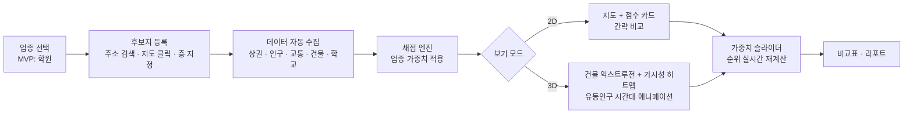
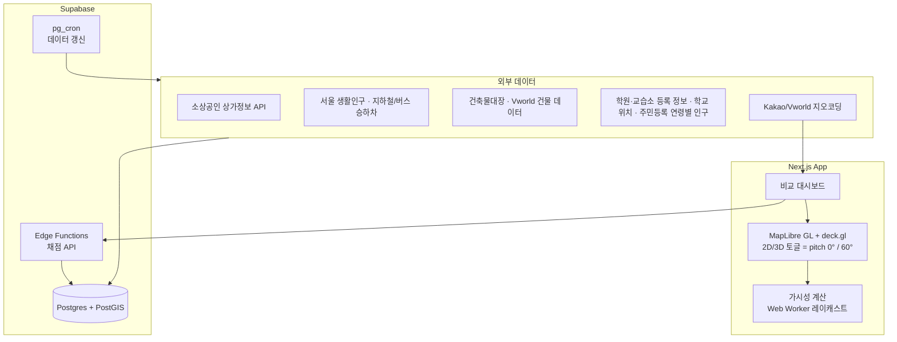

# 길목(GILMOK) 기획서 — 입지 시뮬레이터

> 작성일: 2026-09-16
> 상태: 변경 (v1.2)
> Concept: 서비스업 창업자가 후보 점포 여러 곳을 3D 지도 위에서 데이터 기반 점수와 함께 나란히 비교하고, 조건을 바꿔가며 "목"을 시뮬레이션하는 웹 서비스. 첫 업종은 학원.

---

## Phase 1: 이해도 체크 결과 (최종)

| 차원       | 적용 도구          | 확정된 내용                                                                                                                                    | 이해도 |
| ---------- | ------------------ | ---------------------------------------------------------------------------------------------------------------------------------------------- | ------ |
| Focus      | MoSCoW             | Must: 후보지 다중 비교 + 종합점수·항목별 근거 + 2D/3D 토글 + 3D 가시성 분석. Should: 가중치 조정(what-if). Could: 업종 프리셋 확장, 리포트 PDF | 88%    |
| Why        | JTBD               | 창업자가 중개사 말·감 대신 데이터로 입지를 검증하고, 여러 후보를 같은 기준으로 저울질하는 일                                                   | 85%    |
| Definition | Scope In/Out       | In: 서울, 학원업 채점 로직, 후보지 최대 5곳. Out: 매출 예측, 임대료 데이터, 서울 외, 학원 외 업종(구조만 열어둠)                               | 85%    |
| Dividing   | User Story Mapping | 후보지 등록 → 데이터 수집 → 채점 → 2D/3D 비교 → 가중치 조정 → 리포트                                                                           | 88%    |

**전체 이해도: 86%** ✅ 통과

### 사용자 결정 사항

- 1차 사용자: 서비스업 창업자 전반. 첫 업종은 학원, 제품명·구조는 전 업종을 담을 수 있게.
- 3D: 시각화("우와 포인트")와 분석(가시성) 둘 다. 단, 2D 토글로 간략 보기 제공. 2D만으로도 핵심 정보는 완결돼야 함.
- 결과물: 후보지 나란히 비교 + 종합점수/항목별 근거 + 조건 변경 가능.

---

## Phase 2: 기획 아웃풋

### 5. Drawing

#### User Flow



#### 시스템 구조도



### 6. Concept

**엘리베이터 피치**
"서비스업 창업자가 점포 계약 전에 후보지 여러 곳을 3D 지도에서 같은 기준으로 비교하고, 조건을 바꿔가며 어느 자리가 더 좋은 목인지 검증하는 입지 시뮬레이터."

**Value Proposition (보조)**
| 창업자의 Pain | 우리가 해결하는 방식 |
|---|---|
| 중개사 말과 감으로 결정 | 공공데이터 기반 항목별 점수 |
| 후보지끼리 비교 기준이 제각각 | 같은 채점표로 나란히 비교 |
| "2층인데 간판이 보일까?"를 알 수 없음 | 3D 건물 높이 기반 보행자 시선 가시성 계산 |
| 우리 업종에 맞는 분석이 없음 | 업종별 가중치 프리셋(학원부터) |

### 7. Action Plan

#### 기술 스택

- **프론트**: Next.js(App Router), TypeScript, MapLibre GL JS(2D/3D 통합, 오픈소스, 토글은 카메라 pitch만 바꾸면 됨), deck.gl(히트맵·이동 애니메이션 레이어), Zustand(가중치 상태), Web Worker(가시성 계산)
- **백엔드**: Supabase Postgres + PostGIS(반경 조회·집계), Edge Functions(채점 API), pg_cron(주기 갱신), Supabase Auth
- **배포**: Vercel
- **구현 도구**: GPT-6 Astra — 이 문서 + 아래 "구현 스펙"을 입력으로 스프린트 단위 위임
- **대안 검토**: CesiumJS + Vworld 3D 타일은 사실감은 높지만 무겁고 2D 토글이 어색함. MVP는 MapLibre 익스트루전(2.5D)으로 가고, "우와 포인트"는 시간대별 유동인구 애니메이션과 가시성 히트맵으로 만든다.

#### 데이터 소스 매핑 (서울 기준)

| 평가 축       | 지표                                                                     | 소스                                                                                              | 비용       | 확인 필요                                                                                     |
| ------------- | ------------------------------------------------------------------------ | ------------------------------------------------------------------------------------------------- | ---------- | --------------------------------------------------------------------------------------------- |
| 수요          | 반경 500m/1km 학령인구(5~18세), 아파트 세대수                            | 행정안전부 주민등록 연령별 인구, 국토부 공동주택 단지정보                                         | 무료       | 행정동 단위라 반경 집계 시 면적 비례 배분 필요                                                |
| 유동          | 시간대별·연령별 생활인구                                                 | 서울 열린데이터광장 생활인구(집계구)                                                              | 무료       | 학원 골든타임(15~22시) 가중                                                                   |
| 교통          | 지하철 역별 시간대 승하차, 버스 정류장 승하차, 정류장까지 거리           | 서울 열린데이터광장                                                                               | 무료       |                                                                                               |
| 상권          | 반경 내 업종별 점포 수, 상권 경계                                        | 소상공인시장진흥공단 상가정보 API                                                                 | 무료       | 경쟁 밀도는 '수요 대비'로 정규화                                                              |
| 경쟁·클러스터 | 등록 학원·교습소 수, 과목                                                | 서울시교육청 학원·교습소 정보                                                                     | 무료       | 학원은 밀집이 오히려 플러스일 수 있음 → 가중치 부호 실험                                      |
| 학교          | 초·중·고 위치, 학생 수                                                   | 학교알리미 / 나이스 학교기본정보                                                                  | 무료       | 학구도는 v2                                                                                   |
| 건물·가시성   | 층수, 높이, 층별 용도, 승강기 대수, 연면적, footprint                    | 국토부 건축물대장 API(표제부·층별개요), Vworld 건물 데이터                                        | 무료       | 높이 누락 시 층수×3.3m 추정. 학원 등록 가능 용도(2종 근생/교육연구시설, 500㎡ 기준) 필터      |
| 임대료 효율   | 반경 내 상가 매매 단가, 상권 단위 평균 임대료·공실률, 사용자 입력 임대료 | 국토부 실거래가(상업·업무용 매매), 한국부동산원 상업용부동산 임대동향조사(분기), 사용자 직접 입력 | 무료       | 점포 단위 임대료는 공개 데이터 없음 → 상권 밴드 + 사용자 입력. 매물 사이트 크롤링은 하지 않음 |
| 지오코딩      | 주소 → 좌표, 지번/도로명                                                 | Kakao Local 또는 Vworld                                                                           | 무료(쿼터) |                                                                                               |
| (Out) 매출    | 카드 매출 추정                                                           | 나이스비즈맵·카드사                                                                               | 유료       | v2 이후 검토                                                                                  |

#### 층수 반영

- 후보지 등록 시 층을 필수 입력. 가시성 레이캐스트의 목표 높이 = 해당 층 바닥 높이 + 1.5m(간판 기준).
- 건물 적합성 축에 층별 용도 적합 여부(법적 등록 가능성), 승강기 유무, 층 선호 곡선을 반영. 층 선호 곡선은 업종 프리셋에 속함(학원: 2~5층 정상, 카페: 1층 외 감점 등).
- 매매 실거래는 층 정보를 포함하므로 층별 단가 비교 가능.

#### 채점 엔진 설계

- 각 축을 0~100으로 정규화(서울 전체 분포 대비 백분위).
- 종합점수 = Σ(축 점수 × 업종 가중치). 학원 프리셋 초안: 수요 25 / 유동(골든타임) 20 / 교통 15 / 가시성 15 / 경쟁 10 / 건물 적합성(층·용도·승강기) 10 / 임대료 효율 5.
- 임대료 효율 = 수요·유동 점수 합 ÷ 사용자 입력 임대료(또는 상권 평균 임대료 대체). 임대료 미입력 시 상권 밴드로 계산하고 estimated=true 표시.
- 가중치는 슬라이더로 조정 → 클라이언트에서 즉시 재계산. 프리셋 저장 가능.
- 가시성 점수: 후보 점포의 층 높이·방향에서, 주변 보행로 샘플 포인트(정류장·교차로·학교 정문 방향 우선)로 레이캐스트해 건물에 가려지지 않는 비율. 2.5D 익스트루전 데이터로 계산 가능.
- 모든 점수에 "근거" 필드 동봉: 원 데이터 수치 + 서울 평균 + 백분위.

#### 스프린트 계획 (2주 단위, 총 10주)

| 스프린트         | 산출물                                                                                                               | 완료 기준                                                        |
| ---------------- | -------------------------------------------------------------------------------------------------------------------- | ---------------------------------------------------------------- |
| S1 데이터 기반   | PostGIS 스키마, 6개 핵심 데이터 적재 파이프라인(인구·생활인구·교통·상가·건축물 층별개요·실거래가/임대동향), 지오코딩 | 임의 좌표 입력 시 반경 집계 쿼리가 1초 내 응답                   |
| S2 채점 엔진     | 학원 가중치 프리셋, 정규화, 근거 필드, 채점 API                                                                      | 대치동 실제 학원 3곳으로 검증해 직관과 순위가 크게 어긋나지 않음 |
| S3 2D 비교 UI    | 후보지 등록(최대 5, 층·임대료 입력), 지도 마커, 점수 카드, 비교표, 가중치 슬라이더                                   | 2D만으로 의사결정이 가능한 상태                                  |
| S4 3D 레이어     | 건물 익스트루전, 2D/3D 토글, 시간대별 생활인구 애니메이션                                                            | 토글 전환 1초 내, 모바일 제외 데스크톱 60fps 근접                |
| S5 가시성 + 마감 | 레이캐스트 가시성 점수·히트맵, 리포트 화면, 로그인·후보지 저장, 배포                                                 | 포도밭 후보지 1곳을 실제로 평가해 사용                           |

#### 리스크

- 공공 API 쿼터·포맷 변경 → 원본은 배치로 적재해 DB에서 서빙, API 직접 호출 최소화.
- 생활인구가 행정동/집계구 단위라 점포 단위 정밀도에 한계 → "추정"임을 UI에 명시.
- 건물 높이 데이터 결측 → 층수 기반 추정 폴백.
- 3D 성능 → 뷰포트 밖 건물 컬링, 반경 1km로 제한.

### 8. Expectation Effect (As-Is / To-Be)

| 항목        | As-Is                      | To-Be                                   |
| ----------- | -------------------------- | --------------------------------------- |
| 판단 근거   | 중개사 설명 + 현장 방문 감 | 공공데이터 9개 축 점수 + 근거 수치      |
| 임대료 판단 | 비싼지 싼지 비교 기준 없음 | 상권 평균 대비 + 수요 대비 임대료 효율  |
| 후보지 비교 | 메모·엑셀에 흩어짐         | 같은 채점표로 최대 5곳 나란히           |
| 가시성      | 현장에서 직접 올려다봄     | 3D에서 보행 동선별 노출률 계산          |
| 업종 확장   | —                          | 가중치 프리셋 추가만으로 신규 업종 대응 |

측정 지표(첫 3개월): 후보지 등록 수, 가중치 조정 횟수(what-if가 실제로 쓰이는지), 3D 토글 사용 비율, 리포트 저장 수.

### 9. Storytelling (1페이지 요약)

## 🎯 창업자가 후보 점포를 3D 지도에서 같은 기준으로 비교하고 조건을 바꿔가며 목을 검증하는 입지 시뮬레이터

### 왜 필요한가

점포 입지는 창업의 가장 큰 고정비 결정인데, 여전히 중개사 설명과 감에 의존한다. 서울은 생활인구·교통·상가·건축물 데이터가 촘촘히 열려 있어 이를 한 화면에서 비교하는 도구가 실현 가능하다.

### 무엇을 만드는가

서울·학원업으로 시작. 후보지 5곳까지 등록(층·임대료 입력) → 9개 축 자동 채점 → 2D 비교표(핵심) / 3D 지도(건물·유동인구·가시성) 토글 → 가중치 슬라이더로 순위 재계산 → 리포트.

### 어떻게 만드는가

Next.js + Supabase/PostGIS + MapLibre/deck.gl, Vercel 배포. 2주 스프린트 5개(10주). 구현은 GPT-6 Astra에 스프린트 단위로 위임.

### 만들면 뭐가 달라지는가

감 대신 근거 있는 비교. 업종 프리셋 추가만으로 학원 → 카페·필라테스·병의원 등으로 확장.

---

## Astra 전달용 구현 스펙 (S1 프롬프트 초안)

```
역할: 시니어 풀스택 엔지니어. 아래 기획서를 기준 문서로 삼는다.
스택: Next.js(App Router, TS), Supabase(Postgres+PostGIS), MapLibre GL JS, deck.gl, Vercel.
이번 스프린트(S1) 목표: 좌표 입력 → 반경 500m/1km 집계 API.
1. PostGIS 스키마 설계: candidates(floor, user_rent), buildings(footprint geometry, height, floors, elevators), building_floors(building_id, floor, use_code, area), population_age(행정동), living_pop(집계구, hour, age_band), transit_stops(type, boardings by hour), stores(업종코드), academies, schools, commercial_trades(매매 실거래, floor, price_per_m2), rent_survey(상권, quarter, rent_per_m2, vacancy).
2. 각 테이블별 적재 스크립트(Python 또는 TS): 공공데이터포털/서울 열린데이터광장 CSV·API → upsert. 소스 URL과 키는 .env로.
3. RPC: score_inputs(lat, lng, radius, floor) → 9개 축 원시 수치 JSON.
4. 완료 기준: 대치동 임의 좌표에서 1초 내 응답, 테스트 3건.
제약: API 직접 호출은 배치에서만, 프론트는 DB만 조회. 결측 높이는 floors*3.3으로 추정하고 estimated=true 플래그.
```

---

## 변경 이력

| 날짜       | 버전 | 변경 내용                                                                                        | 영향받은 차원        |
| ---------- | ---- | ------------------------------------------------------------------------------------------------ | -------------------- |
| 2026-09-16 | v1   | 최초 작성                                                                                        | -                    |
| 2026-09-16 | v1.1 | 층수 반영(가시성·건물 적합성·프리셋 층 선호), 임대료 효율 축 추가(실거래가·임대동향·사용자 입력) | Definition, Dividing |
| 2026-09-16 | v1.2 | 프로젝트명 "길목(GILMOK)" 확정                                                                   | -                    |
