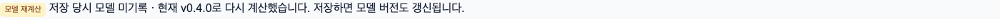

# S3-3 PR 1(M) 저장 모델 안내 검증 — 2026-10-07

상태: **로컬·원격 구현 검증 완료, Ready 전환 대상. 머지는 사용자 수행**. base main `80be024`(#29), 브랜치 `s3/saved-model-notice`. 사용자 승인 D1~D5를 [계획](../planning/s3-3-plan.md)에 반영했고 학원 점 레이어는 S3-4 직후 첫 후속 과제로 확정했다. 이 PR은 지도 A/B 구현을 포함하지 않는다.

## 변경과 의미

기존 `preset_version=0.3`은 입력·가중치 계약으로 유지한다. 새 nullable `scoring_model_version`은 명시적 저장 시 클라이언트가 적용한 모델을 기록하며 서버의 재채점 인증 값은 아니다. 기존 기록은 미기록(NULL)으로 보존한다.

| 상황 | 저장·표시 |
|---|---|
| 알려진 구버전 | “저장 모델 v0.3 · 현재 v0.4.0…” 계산 중/완료/실패 배지 |
| 과거 버전 미기록 | “저장 당시 모델 미기록…”으로 구분, 구버전으로 추정하지 않음 |
| 동일 모델 | 전환 배지 없음, 기존 현재 모델 재채점은 유지 |
| 재계산 성공 | 후보·가중치·순서 보존, 모델 태그는 자동 저장하지 않음 |
| 명시적 저장 성공 | 모든 결과가 현재 모델이면0.4.0 기록·전환 배지 해제 |
| 일부 실패·조회 중·구클라이언트 저장 | NULL 기록. 남아 있는 옛 결과 때문에 현재 모델로 태깅하지 않음 |
| 모델 태그 쓰기 실패 | 후보·비교·가중치 변경까지 원자 롤백 |

## migration 영향·보존 대조

**기존 객체 변경 있음:** `public.comparisons`에 nullable 열/CHECK 추가, `public.save_comparison`을 교체해 구클라이언트 저장 시 모델 태그를 NULL로 초기화, 새 `save_comparison_v2`/권한 추가. 기존 행 백필·삭제·기존 열/테이블 DROP·새 트리거 없음.

- 파일: `20261007085130_comparison_scoring_model.sql` (`supabase migration new` 생성).
- SHA256: `cf686d6b451ae22f65a5219a03af678d4f04c1830fd4a0a66b8eef63f2dda778`.
- 기존 함수의 원격 실제 `prosrc`와 로컬 적용본을 대조: **NULL 초기화 한 줄 외 차이0**. 시그니처·반환 uuid·security definer·빈 search_path·authenticated EXECUTE/anon 거부 유지.
- 새 함수는 별도 이름을 사용해 PostgREST overload 모호성을 피한다. 기존 저장 함수를 같은 트랜잭션에서 호출한 뒤 모델 태그를 기록한다.
- 새 트리거는 없다. 모델 태그는 저장 정합성이므로 실패를 삼키지 않는다. 기존 활동/투영 부수 기록 격리와 후보 삭제 정합성 트리거·updated_at은 유지한다.

## 로컬 DB

실제 로컬 Supabase에 새 migration1개를 적용했다. 기존42개에서43개로 증가했고 적용 전 비교0개다. 테스트는 새 uid/후보를 사용하고 DB 테스트는 롤백, 브라우저 테스트 uid는 finally에서 삭제한다. DB reset·원천 재적재는 하지 않았다.

- 구RPC 저장→모델NULL, v2 저장/재시도→0.4.0, 구RPC 재저장→NULL. 후보 순서·가중치·기존 입력 계약0.3 보존.
- 두 uid: 다른 사용자의 비교 조회NULL·저장 거부, 자신의 데이터 보존. anon은 두 저장 RPC EXECUTE 거부.
- 잘못된 모델 태그는 후보·비교0행 생성으로 거부한다.
- 강제 P0001: 시험용 BEFORE 트리거가 v2의 모델 태그 UPDATE에서 실패하도록 설정했다. 그 전에 실행한 후보 이름 변경·신규 후보·가중치 변경은 모두 롤백됐고 전체 저장 JSON이 실패 전과 동일했다. 시험 트리거는 롤백되며 제품 migration에는 없다.

## 브라우저 E2E·회귀

[브라우저 수치 JSON](s3-3-model-e2e-20261007.json). 실제 로컬 Auth/RPC/Worker + 고정 공개 주소 공급자 응답으로 기존 등록→채점→슬라이더→저장→같은 uid 재열기 시나리오를 확장했다.

- a~e 5곳 등록·모바일 동일 점수/근거·슬라이더·명명 가중치·수동 순서·같은 uid 재열기 통과.
- 해당 테스트 비교의 저장 모델만0.3/NULL로 설정해 구버전/미기록 배지를 각각 확인했다. 다른 비교를 수정하지 않았다.
- 0.3 비교 재열기에서 `score_inputs` HTTP503을 의도적으로 주입해 실패 배지와 재시도를 검증했다. 차단 제거 후 실제 RPC/Worker로 복구했다. JSON에 남은503은 이 로컬 장애 주입이며 원격 장애 실측이 아니다.
- 재계산 완료 후 DB 태그가 여전히0.3/NULL임을 확인한 뒤 “비교 저장”으로0.4.0이 되고 배지가 없어지는 것을 확인했다. 같은 uid로 다시 열어 동일 모델에는 배지가 없음을 검증했다.
- 1 passed, 시나리오20.3초/전체23.3초. 슬라이더100회 **p95 33.7ms / max33.8ms**. 기준 p95≤100ms 통과.

| 후보 | v0.4.0 기본 총점 | #29 대비 |
|---|---:|---:|
| a 역삼로460 3층 | 83.10201719669011 | 0 |
| b 도곡로409 2층 | 92.60289331263688 | 0 |
| c 역삼로546 3층 | 82.67204741731668 | 0 |
| d 역삼로460 4층 | 81.84736541572254 | 0 |
| e 역삼로460 1층 | 85.08500496915157 | 0 |

`pnpm lint`, `pnpm typecheck`, `pnpm test`(Vitest183·Python269), `pnpm test:db`(235), `pnpm build`, `pnpm test:e2e` 통과. 알려진 버전/미기록/동일 버전, 부분 실패·retry·읽기 전용 스냅샷·uid 변경 초기화·저장 실패 시 태그 불변을 단위 테스트에 포함한다.

## 원격 최종 dry-run

[사전 확인 JSON](s3-3-model-preflight-20261007.json). 읽기 전용 SQL로 현재 원격42개 migration(마지막20261004114603), 비교2개, 새 모델 열 부재를 확인했다. 기존 함수 권한/설정/본문 보존 대조 후 CLI dry-run을 실행했다.

```text
supabase db push --linked --dry-run
exit 0 · 0.526초
Would push these migrations:
 • 20261007085130_comparison_scoring_model.sql
DRY RUN: migrations will *not* be pushed to the database.
```

이 최초 dry-run 시점에는 원격 쓰기·push·환경변수 변경·운영 스위치 변경을 실행하지 않았다. 기존 비교2개는 migration 뒤에도 과거 모델을 추정하지 않고 NULL로 둔다. 사용자 push 승인 후 실제 원격 구·신 저장/uid 격리·재열기를 확인하고 프론트를 배포하는 순서다. 이 시점에는 원격 live E2E 미실행이었으며, 이후 승인 실행 결과는 아래에 기록한다.

[배포 순서·롤백 SQL](../operations/saved-model-version.md)을 따른다. 이전 프론트/구RPC로 복귀할 수 있으며 확장 열·데이터는 보존한다. 새 프론트는 v2 RPC가 필요하므로 원격 migration 승인 전에는 Draft를 유지한다.


## 사용자 승인 후 원격 적용·검증

[원격 실측 JSON](s3-3-model-remote-20261007.json). 코드 `7712ce9`, [PR Preview](https://gilmok-m2vm91qbh-vineyard.vercel.app)에서 확인했다. 기존 사용자 비교에 저장/삭제를 수행하지 않았다.

| 단계 | 결과 | 시간 |
|---|---|---:|
| push 직전 해시·대상 대조 + 최종 dry-run | 승인 SHA256 동일, 대상1개, exit0 | CLI 0.461초 |
| 승인 migration push | exit0, migration43개/마지막20261007085130 | 0.476초 |
| 실제 익명 Auth·구/신 저장·격리·재열기 + 기존 배지 표시 | Playwright1개 통과 | 시나리오19.811초 / 실행20.487초 |
| 사후 읽기 전용 DB 대조 | 기존 비교2·연결 후보5 digest 불변, 기존 모델NULL2, 미해결 projection_errors0 | 2026-10-07 10:55:22 UTC 확인 |

기존 객체 변경: `comparisons` nullable 열/CHECK 추가, 기존 `save_comparison` 함수 교체(NULL 초기화1줄), 신규 `save_comparison_v2`·권한 추가. 승인된 파일 외 migration·운영값 변경 없음. 함수2개의 security definer/빈 search_path/authenticated EXECUTE/anon 금지 유지, 주소 dispatch 트리거 `O` 유지.

### 실제 원격 세션·HTTP 검증

- 실제 익명 uid2개로 검증. 신클라이언트 Preview UI에서 역삼로460 3층을 등록하고 저장해 모델0.4.0을 확인했다. Juso 검색·Vworld 좌표 호출은 각각 HTTP200, icn1이었다. 총점 **83.10201719669011**, 기존 v0.4.0과 동일.
- 구클라이언트 계약은 같은 소유자 세션으로 **기존 `save_comparison` RPC와 기존 요청 형식**을 호출해 검증했다. 모델 태그가NULL이 되고 후보·가중치·순서 계약을 유지한다. 구버전 Production 화면의 전체 E2E를 별도 실행한 것은 아니다.
- 실제 Preview에서 같은 uid로 재열기 → “저장 당시 모델 미기록”/재계산 완료. 읽기·재계산만으로 모델 태그가 바뀌지 않음을 원격 RPC로 확인했다. 명시적 저장 →0.4.0, 재열기 → 배지 없음·동일 점수. 새 signup은 해당 브라우저당1회.
- 다른 uid의 `load_comparison`은NULL, candidates/comparisons SELECT는 빈 배열. 구·신 저장 RPC 모두42501로 거절되고 소유자 저장 JSON이 거절 전후 동일했다.

### 기존 비교2개의 미기록 표시와 검증 한계

기존 비교2개는 모델NULL이며 연결 후보5개를 포함해 **비교/후보 전체 행 digest가 push 전→push 후→시험 후 동일**하다. 실제 소유자의 브라우저 세션은 보유하지 않으므로, 읽기 전용 SQL에서 소유자 uid와 authenticated RLS로 `load_comparison`을 조회했다. 그 **무변형 실제 응답만** Preview의 조회 응답으로 재생하고 저장 요청은 차단했다. 채점 RPC와 Worker는 실제 원격 경로를 사용했다. 두 건 모두 배지 `complete`와 아래 문구를 확인했다. 소유자 JWT 발급이나 기존 사용자로 로그인한 E2E라고 주장하지 않는다.

> 저장 당시 모델 미기록 · 현재 v0.4.0로 다시 계산했습니다. 저장하면 모델 버전도 갱신됩니다.




최초 원격 시험은 검증 스크립트가 현재 등록 화면에 없는 버튼을 기다려236.406초에 중단했다. 제품 변경 없이 현행 선택자로 수정한 뒤 위 시험이 통과했다. 최초 시험은 익명 uid2개만 생성했고 후보/비교 저장 전이었다. 완료 시험의 uid2개·후보1개·비교1개를 포함해 시험 uid 총4개를 보존했으며 삭제·정리 apply는 실행하지 않았다. 운영 스위치와 Production 배포는 변경하지 않는다.
