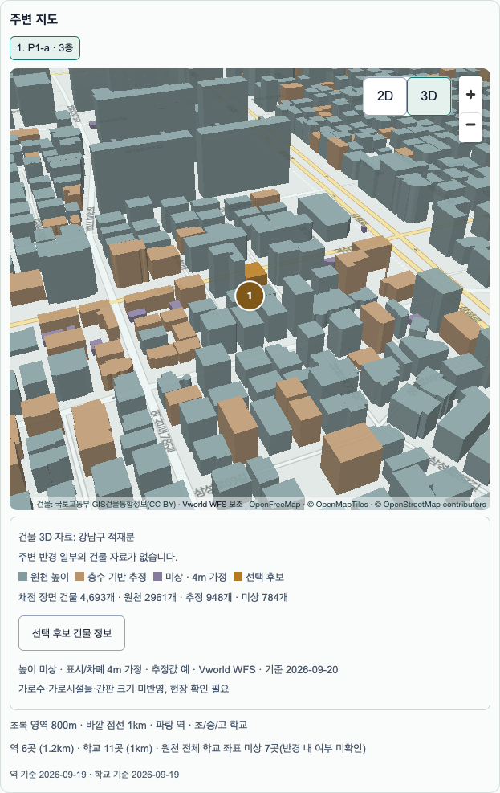
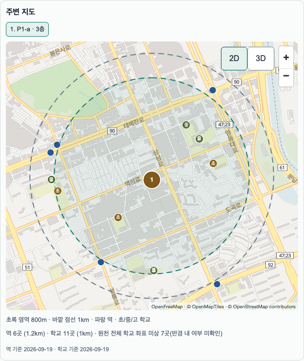

# S3-4 P1 원격 push·HTTP·Preview — 2026-10-10

**승인된 migration 1개 적용 및 원격/Preview 검증 통과. 최대 셀 3초 기준 통과.** 제품 코드·좌표 정밀도·반경·높이·컴퓨트 설정 변경 없음. 기존 [로컬/CI 검증](s3-4-p1-20261008.md), [실제 GPU FPS 6회 통과](s3-4-p1-fps-20261009.md)와 합쳐 P1 완료 기준을 충족한다. 사용자가 머지한다.

[원시 측정 JSON](s3-4-p1-remote-20261010.json)

## 승인 범위와 push

- 새 함수 `public.project_exposure_geometry(jsonb)`와 해당 권한만 추가. **기존 객체·테이블·행·트리거 변경 없음.**
- `20261008085649_project_exposure_geometry.sql`, SHA256 `de6dafa5a147dda8adb2f77e0deb5e46a950fc81c1f2cb9dfce7456d4fce763c` 재대조.
- push 직전 원격 migration 기록을 읽어 예정 파일이 위 1개뿐임을 확인. 최종 dry-run exit0 **0.518초**, push exit0 **0.455초**. 적용 버전 기록 확인.
- 기존 public 함수 정의 hash diff **0**. 새 함수 IMMUTABLE·SECURITY INVOKER·빈 search_path/extra_float_digits3, authenticated EXECUTE=true, anon=false 확인.
- Micro 유지. 원격 응답 제한·컴퓨트·데이터·압축 설정은 변경하지 않았다. 롤백은 [운영 문서](../operations/compare-map.md)의 신규 함수 권한 회수/DROP 절차다.

## 익명 세션 HTTP: 실제 gzip 전송

원격 Auth 익명 signup으로 받은 **authenticated 세션**으로 POST `/rest/v1/rpc/project_exposure_geometry`를 호출했다. 원격 `exposure_inputs_v022` 장면의 건물 도형 전체를 그대로 입력한다. 첫 요청 1회+동일 연결 재사용 2회, 후보별 순차 실행. 요청은 무압축 JSON, `Accept-Encoding: gzip`. 자동 압축 해제를 끄고 실제 수신 본문을 읽은 뒤 gzip을 풀어 byte 수와 id/순서/개수를 확인했다.

시간은 요청 시작부터 **압축 응답 본문 수신 완료**까지의 wall time(업로드·서버 처리·다운로드 포함). JSON 파싱 시간은 제외하며 header 수신 시각도 원시 JSON에 별도 기록했다. 아래 3회 값은 HTTP p95라고 부르지 않는다. 모든 호출 **HTTP200, gzip, id/순서/개수 일치**, timeout0.

| 후보 | 건물 수 | HTTP 1/2/3회 ms | gzip 전 byte | 실제 gzip 후 byte 범위 |
|---|---:|---:|---:|---:|
| a | 4,693 | 1372.254 / 1180.842 / 1654.378 | 2,398,355 | 671,613~671,691 |
| b | 4,431 | 895.476 / 1156.335 / 1145.676 | 2,317,240 | 651,643~651,693 |
| c | 3,843 | 726.891 / 1004.886 / 707.990 | 1,871,883 | 521,311~521,311 |
| max | 8,336 | 1670.285 / 1718.465 / 1749.294 | 3,895,790 | 1,070,018~1,070,059 |

a=역삼로460, b=도곡로409, c=역삼로546. max=`다사58754600`, 중심 `(lat37.5134932491884, lng127.03465041079)`, **8,336개/74,753정점**. 원격 자료에서도 로컬 서울 10,127셀 전수 조사 당시의 최대 셀 건물 수와 일치했다. 이번 실행에서는 전 셀 재전수 조사를 하지 않았다.

최대 셀 HTTP **1,670.285 / 1,718.465 / 1,749.294ms**로 모두3,000ms 이내. gzip 전3,895,790byte → 후약1,070,000byte(약72.5% 감소). 서버가 실제 gzip을 이미 제공하므로 추가 압축/정밀도 축소/반경 축소는 구현하지 않는다. 3회 표본이 모든 네트워크·동시 부하에 대한 보장은 아니다.

실제 서버 gzip 크기와 비교용으로 로컬에서 다시 gzip9한 크기는 다르며 JSON에서 구분했다. 표에는 실제 wire body byte를 사용한다(HTTP 헤더/TLS 오버헤드 제외). 브라우저가 다른 압축 방식을 협상하는 경우의 전송량으로 일반화하지 않는다.

## 직접 SQL: 각 30회 웜 p95

각 HTTP 측정 후 동일 입력으로 `EXPLAIN (ANALYZE, BUFFERS, FORMAT JSON)` 첫 관측+30회. IMMUTABLE 상수 평가의 planning 이동을 포함하기 위해 **Planning+Execution** 합계를 사용했다. HTTP와 달리 네트워크 전송 시간을 포함하지 않는다. 첫 관측도 이미 HTTP로 예열된 상태이며 **I/O cold 수치가 아니다**. 다른 검증 작업을 동시에 실행하지 않았다.

| 후보 | SQL 첫 관측 ms | 이후30회 p95 ms | max ms |
|---|---:|---:|---:|
| a | 290.964 | 289.235 | 289.485 |
| b | 265.990 | 272.307 | 330.848 |
| c | 205.547 | 215.421 | 216.341 |
| max | 489.377 | 505.982 | 559.192 |

## 실제 Preview

배포: [gilmok-p80qjesu5-vineyard.vercel.app](https://gilmok-p80qjesu5-vineyard.vercel.app/compare), HEAD790ef42의 Preview. 새 익명 브라우저에서 Juso 주소 선택·등록 좌표 조회·원격 RPC·Worker·실제 OpenFreeMap 스타일로 역삼로460 3층을 등록했다. 응답 fixture/지도/DB mock 없음. Preview 보호 우회 토큰은 요청 헤더로만 전달하고 기록하지 않았다.

- 등록/주소 Route Handler HTTP200·icn1. score_inputs, exposure_inputs_v022, percentile, map context, projection RPC 모두200.
- 3D 진입 전 projection 호출0, 진입 후1회. zoom17/pitch55, 건물4,693개(원천2,961/추정948/unknown784).
- 실제 지도 픽셀을 클릭해 3종 근거 확인: 원천152.05m(estimated=false), 층수 기반49.5m(estimated=true), unknown4m(estimated=true). WFS 출처도 확인.
- `건물 3D 자료: 강남구 적재분`, `주변 반경 일부의 건물 자료가 없습니다.`, 3종 범례 및 현장 확인 문구 표시 확인.
- 2D 복귀 시 pitch0·기존 center/zoom 복원, 건물3D 패널 해제. 총점 **83.10201719669011** 유지. JS pageerror0.
- Preview 검사1개 통과(9.1초). 첫 시도는 검사 스크립트의 예상 문구가 실제 UI와 달라 중단됐다. 실제 문구로 검사만 정정했고 제품 코드는 변경하지 않았다. 실패·성공 양쪽 테스트 uid와 HTTP 측정 uid는 자기 테스트 계정만 삭제 완료.
- Preview는 headless 기능 검사다. 실제 GPU FPS는 10월9일 별도 검증 결과를 사용한다.

## 완료 기준

- [x] 승인된 migration1개 적용·기존 함수 불변·권한 확인
- [x] 원격 익명 세션 a/b/c/최대 셀 응답 시간·실제 gzip 전/후 크기
- [x] 최대 셀3초 이내·timeout0
- [x] Preview 3D 토글·높이3분류·범위 문구·2D 복귀
- [x] 로컬/CI·번들·실제 GPU FPS 기존 결과 유지(제품 코드 변경 없음)

P1 완료. P2 노출 오버레이는 #35 사용자 머지 후 별도 착수한다. 공개 전 Micro 합본 부하/Small 전환 재검증 및 일반 노트북 FPS 조건은 기존 체크리스트대로 남는다.
